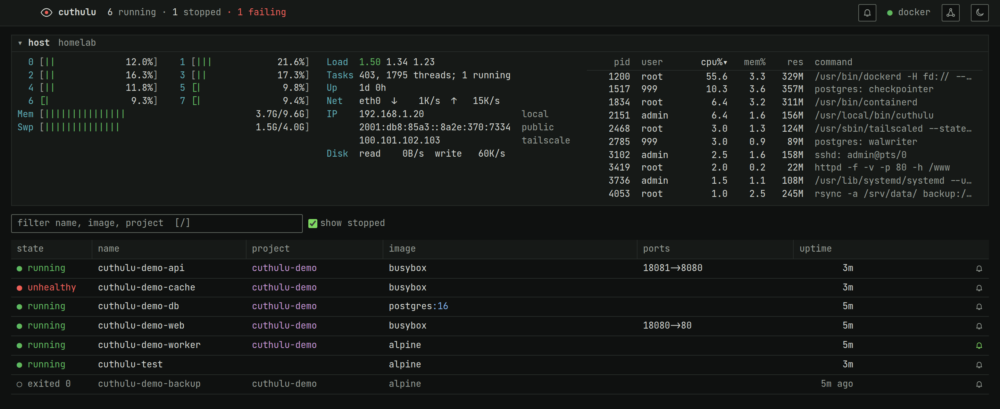
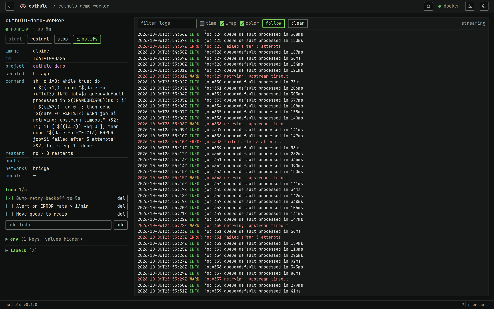

# cuthulu

> The eye that never sleeps.

A self-hosted dashboard that watches the services running on your Linux
machine — Docker containers first — and lets you see their status, read their
logs and start / stop / restart them from one place. Cuthulu itself runs as a
container.

**Status:** early but usable — the dashboard, live updates, logs and
start/stop/restart work. See the [roadmap](docs/ROADMAP.md).

<picture>
  <source media="(prefers-color-scheme: light)" srcset="docs/screenshots/dashboard-light.png">
  
</picture>



## Features

- Auto-discovers every container on the host, no configuration
- Live state updates (event-driven, no polling)
- Live log tailing with search and stderr highlighting
- Start / stop / restart, with protection against stopping itself
- htop-style host panel: per-core CPU, memory, swap, load, IP addresses,
  network and disk throughput (optionally top processes), read straight from
  `/proc` and sampled only while someone is watching
- Per-service TODO notes, kept in one JSON file (no database)
- Notifications: email and desktop alerts when a watched service goes down
  (bell per service), an email when Cuthulu stops, and a healthchecks.io
  heartbeat — see [docs/DEPLOYMENT.md](docs/DEPLOYMENT.md#notifications)
- Light and dark themes, keyboard driven, dense terminal-style UI
- Scales from a handful to hundreds of services (event-driven, no polling)
- Single static binary in a `scratch` image
- Read-only mode, CSRF protection, strict CSP

## Quick start

```sh
git clone https://github.com/VillegasMich/cuthulu && cd cuthulu
DOCKER_GID=$(stat -c %g /var/run/docker.sock) docker compose up -d --build
```

Open <http://localhost/>, or `http://<machine>/` from your tailnet.

> **Warning:** mounting the Docker socket gives Cuthulu root-level control of
> the host, and there is no login. The compose file publishes port 80 on every
> interface, so anyone on your LAN or tailnet can control your containers;
> publish `127.0.0.1:80:8686` to keep it on this machine. See
> [docs/DEPLOYMENT.md](docs/DEPLOYMENT.md#security).

## Development

```sh
cargo run                                    # http://127.0.0.1:8686, needs access to /var/run/docker.sock
cargo test
cargo clippy --all-targets -- -D warnings
```

Keyboard: `/` filter · `j`/`k` move · `enter` open · `s` start/stop ·
`r` restart · `a` show stopped · `b` notify bell · `m` host panel · `t` theme · `esc` back · `?` help.

## Docs

- [Vision](docs/VISION.md) — what and why
- [Architecture](docs/ARCHITECTURE.md) — how
- [Design guide](docs/DESIGN.md) — look and feel
- [Deployment](docs/DEPLOYMENT.md) — running it
- [Roadmap](docs/ROADMAP.md) — what's next

## License

[MIT](LICENSE)
